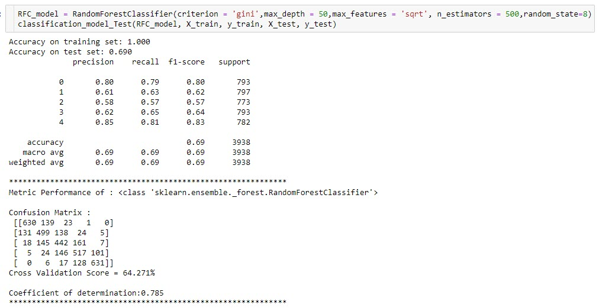

# Home Sales Prediction

## 1.0 Dataset Description
This dataset contains the sale prices for hosues in a country within USA and nformation related to the unit sold. 

## 2.0 Structure
- Folder structure
  - data    : storing the SQL database dataset (also store the classification adn regression preprocessed dataset as well)
  - src     : store the python code library/modules supporting themain python main EDA and training model python program
  - diagram : Store the diagram like ploted chart analysis fom the EDA
  - model   : Store the trained machine learning model 
  
- Files structure
  - eda.ipynb : For the task 1 interactive notebook in python
  - run.sh    : Bash script to run the prediction python code
  - requirements.txt : for the pythonlibrary installation requirements (This file is empty as most library are in the default python virtual env setup
  - model_training.ipynb : The task 2 end-to-end Machine Learning Pipeline interactive notebook in python 
  - Home_sales_regression_prediction.py : The end-to-end selected regression prediction model python file
  - Home_sales_classification_prediction.py : The end-to-end selected classification prediction model python file

## 3.0 Checking on dataset statistics
- The dataset has a house that has range of 0 to 11 bedrooms, 0 to 8 bathrooms with 1 to 3.5 floors.
- It has basement size of 0 to 4820 sqft and built years from 1900 to 2015. This basement_size features seems to have many 0 value may not be a good candidate for the feature engineering
- renovation feature which describe the year of renovation of the house data has shown dicreprancy since it ranges from 0 to 2015. This features seems to have many 0 value may not be a good candidate for the feature engineering
- Category features are (Will be using label-encoding)
    - bedrooms
    - bathrooms
    - floors
    - waterfront
    - view
    - condition
    - review_score
- There are total of 3466 rows of null data
- Price, bedrooms, bathrooms, view, Living_room_size and review_score has some outliers
- Basement_size & renovation has very high number os 0 data and due to this 0 data has lots of outliers in boxplot chart. Hence these two features will be dropped 
- Also the features shows not much correlations

## 4.0 Checking on each feature characteristics - How they affect the House Price
- Bedrooms
  - As we can see 3 bedroom houses are most commonly sold followed by 4 bedrooms
  - 6 bedrooms fetches the highest price follow by 5 bedrooms and lowest for bedroom size like > 10 and <2
- Bathrooms
  - As we can see 2.5 bathroom houses are most commonly sold followed by 1 bathroom
  - In general, 4 to 5 bathrooms fetches high price for the housebut most transaction concentrated between 2 to 4 bathrooms
- Floors
  - As we can see 1 floor houses are most commonly sold followed by 2 floors
  - 2 floors fetches the highest price for the house follow by 1 floor houses
- waterfront
  - As we can see 0 indicate no waterfront which contain most of the transactions - most prefer no waterfront ?
  - Both with or without waterfront command similiar pricing
  - This shows no differentiation between choices of with or without waterfront since both sahre the similar pricing demand but without waterfronts seems to has the major transactions
- view
  - As we can see internal rating view of the hosue with 0 has the highest transactions
  - Almost all view command similiar pricing - seem like this feature does not really have big impact on the pricing
- condition
  - As we can see fair condition has the highest transactions follow by good conditions
  - In general fair and good condition housing pricing has the highest and of course we expect low pricing for the terrible condition but excellant condition doesn't really reflect the price demand
  - This indicate not much motivation for excellant condition housing to fetch high price
- review_score
  - As we can see review score of 7 has the highest transactions follow by 8
  - In general score review of 6 to 8 has the concentration of housing pricing demand and of course we expect low pricing for the low score but top score doesn't really reflect the price demand
- basement_size
  - As we can see basement_size of 600 has the highest transactions and is rnage is from 0 to 4820 sqft and has 13302 null data. This feature should not be used for predicting.
  - Most of the price transacted are below $2m concentrated in the basement size between 0 to 2000 sqft
- built
  - As we can see built year of 2014 has the highest transactions and is rnage is from year 1900 to 2015. This shows that mmost prefer new housing
  - In genearl the pricing shares similiar pattern for all built years
- renovation
  - As we can see renovation year of 2014 has the highest transactions and is range is from year 0 to 2015 and has 20963 0 data. This feature should not be used for predicting
- zipcode
  - As we can see zipcode of 98103 & 98038 share the highest transactions and is range is from 98000 to 98200
  - Most share the similiar pricing pattern except for some from range 98000 to 98010 and 9803X has some outliers of high pricing  
- latitude
  - As we can see latitude of 47.5322 has the highest transactions
  - Price demand in the range 45.5 to 45.7
- longitude
  - As we can see longitude of 122.29 has the highest transactions
  - Price demand in the range -122.3 to -122.1
- living_room_size
  - As we can see living_room_size of 1440 has the highest transactions
  - living_room_size and price has positive correlation
  - It has range between 399 to 6210 sqft and we can see many preferred around 1400 to 1600 in size. On average most are in the range between 1000 to 3000 sqft probably due to the price per sqft charge as there is positive correlation between living room size and the price
- lot_size
  - As we can see lot_size of 5000 has the highest transactions
  - Seems like most demand is in the smallest lot size
  - It has range between 651 to 871200 sqft and we can see many preferred around 5000 to 8000 sqft in size. This is probably due to maintainance effort for huge area consideration

## 5.0 Machne Learnng Model selection
- Others machine learning are not try as they require sacling and may not be able to handle outliers and imbalance data as well as the Random Forest and Gradient Boosting
**Random Forest**
- Pros:
  - Random forests are bagged decision tree models that split on a subset of features on each split.
  - Each split of the tree, the model considers only a small subset of features (Which are are selected at random) rather than all of the features of the model. This is important so that variance can be averaged away.
  - It can handle binary features, categorical features, and numerical features. There is very little pre-processing that needs to be done. The data does not need to be rescaled or transformed
  - They are parallelizable, meaning that we can split the process to multiple machines to run
  - Is great with high dimensional data since we are working with subsets of data
  - handles outliers by essentially binning them
  - It has methods for balancing error in class population unbalanced data sets. 

- Cons:
  - Model interpretability: Random forest models are not all that interpretable; they are like black boxes.
  - For very large data sets, the size of the trees can take up a lot of memory.
  - It can tend to overfit, so require to tune the hyperparameters.
  - For data including categorical variables with different number of levels, random forests are biased in favor of those attributes with more levels. Therefore, the variable importance scores from random forest are not reliable for this type of data
  - If the data contain groups of correlated features of similar relevance for the output, then smaller groups are favored over larger groups

**Gradient Boosting**
- Pros:
  - Since boosted trees are derived by optimizing an objective function, basically GBM can be used to solve almost all objective function that we can write gradient out. This including things like ranking and poission regression, which RF is harder to achieve

- Cons:
  - GBMs are more sensitive to overfitting if the data is noisy.
  - Training generally takes longer because of the fact that trees are built sequentially.
  - GBMs are harder to tune than RF. There are typically three parameters: number of trees, depth of trees and learning rate, and each tree built is generally shallow

## 6.0 Classification Approach
- I have tried using pandas qcut and cut to allocate for the price category
- Using pandas cut for customised grouping creates unequal group size like in the group size 8 to 10 creates the last few class with only with few samples especially the last class mostly end up only 1 sample
- Using pandas qcut will be able to generate quire equal amount of data samples for each class
- Have tested qcut grouping between 4,5 and 6. For classification, it is always easier to get high accuracy for lower number of classes. 
- But with Housing pricing , 4 classes is not practical. Having 6 will lower the accuracy.
- Hence I decided to use group size of 5
- Tested using Random Forest Classifier and Gradient Boosting Classifier 

### 6.1 Test result between 10 features 6 group and 13 features 5 group results (Classification Approach)
- 10 features 6 group or 13 features 5 group
  - Previous test of 10 features (Drop off 'view','waterfront','floors') and 6 group results 
  - which is as expected is lesser accuracy since more class to predict
  - Using all 13 features has very slight improvement from test accuracy 62.4% to 69%
  - Cross Validation Score also improve quite a lot from 56.652% to 64.271%
  - Though 13 features with 4 group pricing yield better results but with only 4 group pricing, it may not be practical since the range is too large to really distinguish different class of house
  - Valuation set has 100% accuracy, hence this shows good model to deploy for Home sales Classification prediction
  - Hence 13 features with 5 group offers a more practical approach
- Random Forest CLassifier (RFC) or Gradient Boosting Classifier (GBC)
  - Comparing the results, it seems like RFC has a bit better accuracy than GBC
  - Also RFC model is 450MB while GBC is about 900MB. Hence with consideration of deployment and inference, RFC is a better choice

<h3>
10 features 6 group RFC
<h3>

<h3>
13 features 5 group RFC
<h3>

### 6.2 Metric Performance Results Analysis
**Metric Performance**
  - accuracy is not a great measure of classifier performance when the classes are imbalanced
  - We need more information to understand how well the model really performed. Did it perform equally well for each class? Were there any pairs of classes it found especially hard to distinguish? We can find out with a confusion matrix
  - To get even more insight into model performance, we should examine other metrics like precision, recall, and F1 score
  - Precision is the number of correctly-identified members of a class divided by all the times the model predicted that class
  - Recall is the number of members of a class that the classifier identified correctly divided by the total number of members in that class.
  - F1 score is a little less intuitive because it combines precision and recall into one metric. If precision and recall are both high, F1 will be high, too. If they are both low, F1 will be low. If one is high and the other low, F1 will be low. F1 is a quick way to tell whether the classifier is actually good at identifying members of a class
- Cross validation is a procedure used to avoid overfitting and estimate the skill of the model on new data
- Coefficient of determination or R squares tells us the proportion of variance in the outcome measure that is explained by the predictors
- On its own, a classification report tells us generally what kind of errors the model made, but it doesn’t give us specifics. The confusion matrix tells us exactly where mistakes were made, but it doesn’t give us summary metrics like precision, recall, or F1 score. Using both of these can give us a much more nuanced understanding of how our model performs, going far beyond what an accuracy score can tell us and avoiding some of its pitfalls.

**Result Analysis**
- RFC
  - accuracy is very high for training set at 99% but only achieve 62.4% on test set. 
  - However, valuation set has 99% same as training set. This may be due to some outliers found in test set
  - Class 0 & 4 has higher accuracy compare to class 1,2 & 3
  - Cross Validation Score is not high at 78.5%
- GBC
  - accuracy is nvery high for training set at 100% but only achieve 73.8% on test set. 
  - However, valuation set has 99% same as training set. This may be due to some outliers found in test set
  - Class 0 & 3 has higher accuracy compare to class 1 & 2
  - Cross Validation Score is not high at 69.91% 
- The feature importance has shown that waterfront and view has most least importance contributing to the prediction of the price as the same analysis in the EDA using the bar and scatter plot 
- It has similiar feature importance captured as Random Forest Classifier

## 7.0 Regression Approach
- Using Random Forest Regressor training result at 97.6% and test result at 82.3% using max_depth 50 and 300 n-estimator.
- Using Gradient Boosting Regressor trainng rsult at 99.8% and test result at 82.9% using max_depth 50 and 300 n-estimator.
- RFR Valuation result at 81.7% & GBR at 81.8%
- Both RFR and GBR share similiar results but 475MB RFR model size compares to GBR 750MB, RFR is better

### 7.1 Test result (Regression Approach)
- Random Forest Regressor (RFR) or Griadient Boosting Regressor (GBR)
  - Comparing the results, it seems like RFR has a very slight better accuracy than GBR
  - Also RFR model is 285MB while GBR is about 455MB with both using depth of 50 and n-esitmator of 300. Hence with consideration of deployment and inference, RFR is a better choice

<h3>
13 features RFR
<h3>

<h3>
13 features RFR Valuation
<h3>

<h3>
13 features GBR
<h3>

<h3>
13 features GBR Val Valuation
<h3>

### 7.2 Metric Performance Results Analysis
**Metric Performance**
  - Mean Absolute Error (MAE): MAE measures the average magnitude of the errors in a set of predictions, without considering their direction. It’s the average over the test sample of the absolute differences between prediction and actual observation where all individual differences have equal weight.
  - Root mean squared error (RMSE): RMSE is a quadratic scoring rule that also measures the average magnitude of the error. It’s the square root of the average of squared differences between prediction and actual observation
  - the RMSE should be more useful when large errors are particularly undesirable
  
**Result Analysis**
- RFR
  - Using depth of 50 and n estimator of 300, need to reduce both and hence get very low accuracy results
  - accuracy is at only 40% for training set but only achieve 4% on test set. 
  - However, valuation set has 81.7% same as training set. This may be due to some outliers found in test set
  - It has about $81848 error rate for price prediction which is considered acceptable
  - Valuation shows simliar to test results
- GBR
  - accuracy is very high for training set at 99.8% and achieve 82.9% on test set. 
  - However, valuation set has 99% same as training set. This may be due to some outliers found in test set

- The feature importance has shown that waterfront and view has most least importance contributing to the prediction of the price as the same analysis in the EDA using the bar and scatter plot 
- It has similiar feature importance captured as Random Forest Regressor 

## 8.0 Discussion & Improvements
- Machine Learning Model 
  - I would like to suggest we can try using CNN Conv1D deep learning using good GPU and may yield better results with smaller model size and better for inferencing.
  - We can also try Support Vector Machine (SVM) 
  - Both SVM and Deep learning requires dataset to be scaled
  - Due to time limitation, SVM and deep learning has not been tried
  - We can further normalised the dataset to refine the model for better accuracy  

## 9.0 Conclusion
**Random Forest vs Gradient Boosting**
- From the training results above, I will recommend Random Forest than Gradient Boosting with reasons as below:
  - Random Forest Regession has similiar accuracy results as gradient Boosting Regression
  - Random Forest are much easier to tune than Gradient Boosting
  - Random Forest are harder to overfit than Gradient Boosting
  - Gradient Boosting take longer time to train
  - Gradient Boosting are more sensitive to overfitting if the data is noisy
  - Random Forest Classifier model has half the size of Gradient Booster Classifier
  
**Classification vs Regression**
- Prediction target 'Price' has continuous values, hence it should a regression problem.
- It will be good to know estimated price of the house using regression prediction model compare to using a range of pricing using classification
- Price group classification probably is good for identifying the different class of houses but not the price of house

So to conclude we can use the RBR regression to show the estimated predicted housing price

## Random Forests vs Neural Network - data preprocessing
 
In theory, the Random Forests should work with missing and categorical data. However, the sklearn implementation doesn't handle this (link1, link2). To prepare data for Random Forests (in python and sklearn package) you need to make sure that:

There are no missing values in your data
Convert categorical data into numerical
Data preprocessing for Neural Networks requires filling missing values and converting categorical data into numerical. What is more, there is a need for feature scaling. In the case of different ranges of features, there will be problems with model training. If you don't scale features into the same ranges then features with larger values will be treated as more important in the training, which is not desired. What is more, the gradients values can explode and the neurons can saturate which will make it impossible to train NN. To conclude, for Neural Network training, you need to do the following preprocessing:

**Fill missing values**
Convert categorical data into numerical
Scale features into the same (or at least similar) range
Keep in mind, that all preprocessing that is used for preparing training data should be used in production. For NN you have more steps for preprocessing, so more steps to implement in the production system as well!

## Random Forests vs Neural Network - model training
 
Data is ready, we can train models.

For Random Forests, you set the number of trees in the ensemble (which is quite easy because of the more trees in RF the better) and you can use default hyperparameters and it should work.

You need some magic skills to train Neural Network well :)

You need to define the NN architecture. How many layers to use, usually 2 or 3 layers should be enough. How many neurons to use in each layer? What activation functions to use? What weights initialization to use?
Architecture ready. Then you need to choose a training algorithm. You can start with simple Stochastic Gradient Descent, but there are many others (RMSprop, Adagrad, Adam, Adadelta ... take a look at optimizers in Keras). Let's go with 'simple' SGD: you need to set learning rate, momentum, decay. Not enough hyperparameters? You need to set a batch size as well (batch - how many samples to show for each weights update).
You know what is funny. That each of the NN hyperparameters mentioned above can be critical. For example, you set too large learning rate or not enough neurons in second hidden-layer and your NN training will be stuck in a local minimum